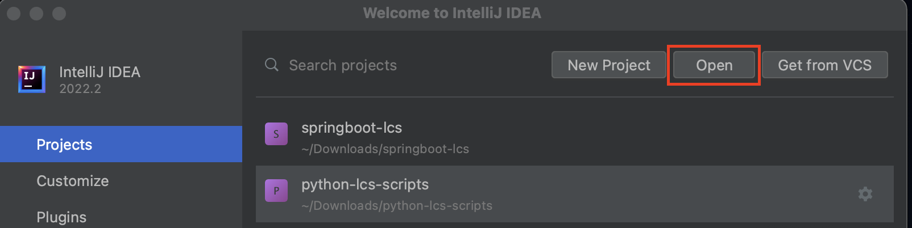
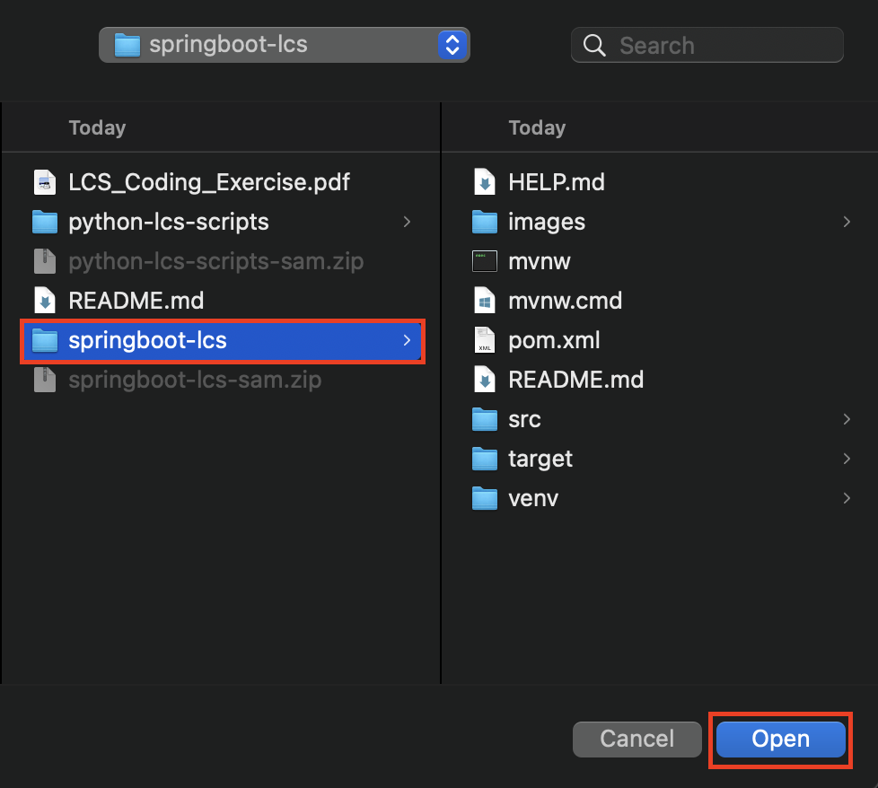
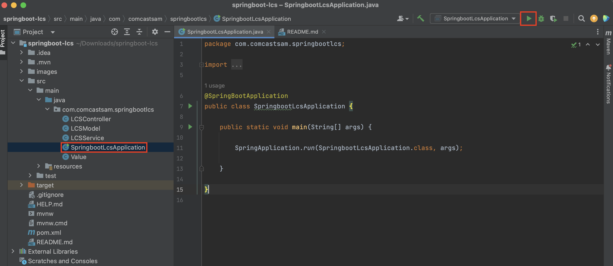
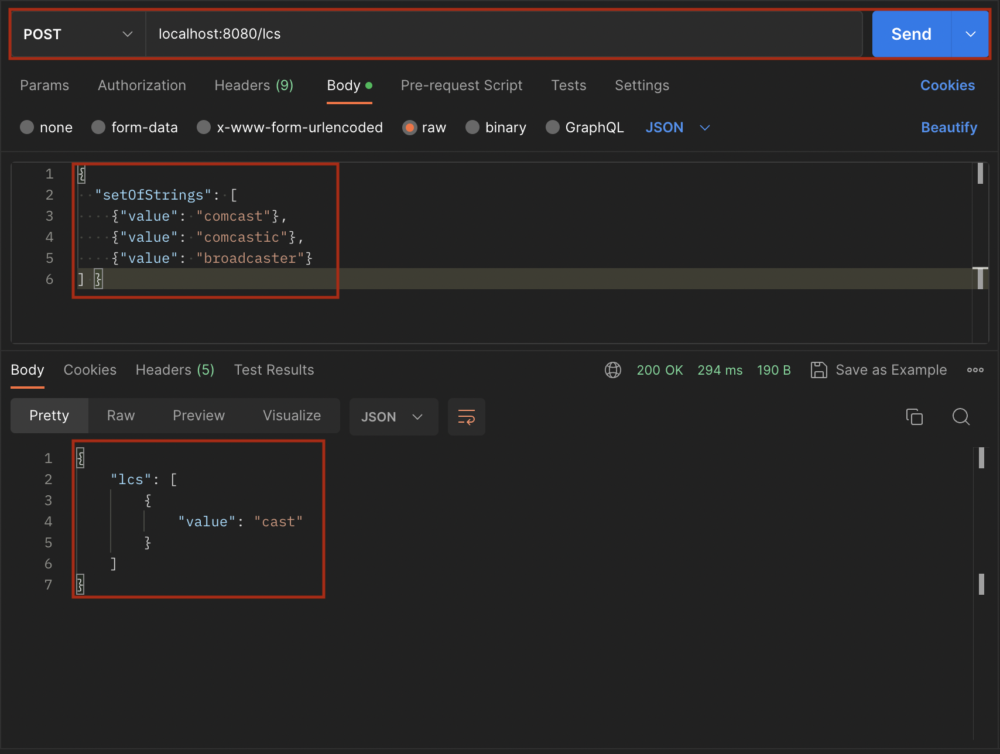
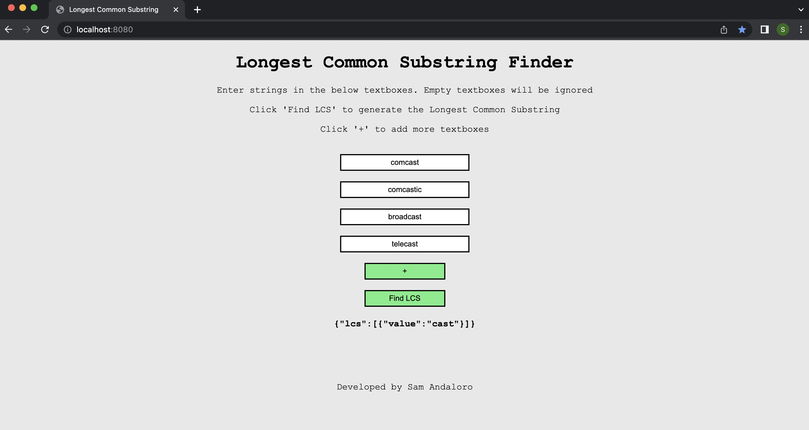
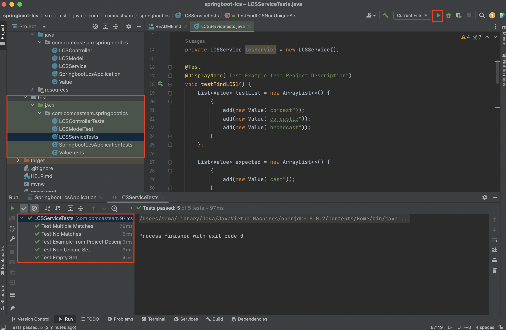
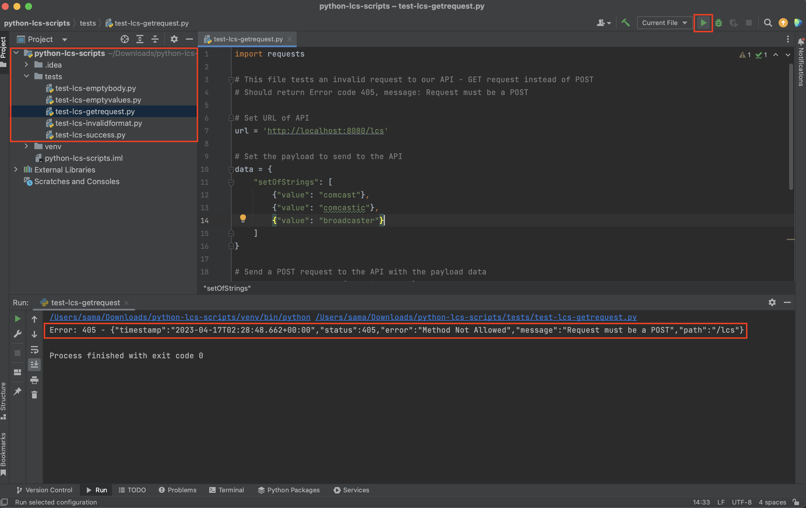

## Longest Common Substring Project
Developed by Sam Andaloro
## Requirements
- Java 17
- IDE (Intellij preferred)
- Python 3.10 (optional - only used for functional tests)
## Setup
1. Unzip springboot-lcs-sam.zip and python-lcs-scripts-sam.zip
2. Open your IDE -> Open

3. Select the springboot-lcs directory

4. Open the file /src/main/java/com.comcastsam.springbootlcs/SpringbootLcsApplication and run the program

## Usage Options
Once the server is successfully started, the API can be tested directly with a tool such as Postman
making a POST request in the following format:

{
"setOfStrings": [
{"value": "stringA"},
{"value": "stringB"},
{"value": "stringC"}
]
}

Alternatively, we can also naviagte to localhost:8080 in a browser to test the API through a webpage

## Testing
Unit tests can be run from src/test/java/com.comcastsam.springbootlcs/

Functional tests can be performed by opening the python-lcs-scripts project and navigating to the tests folder

